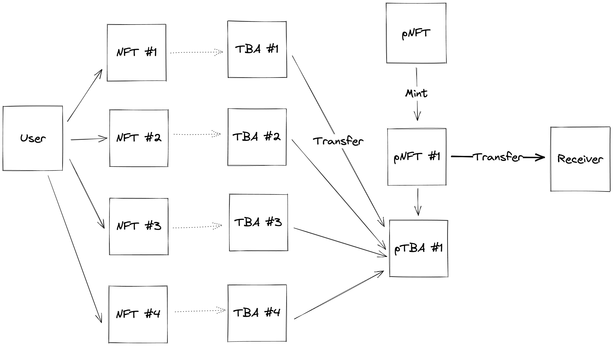
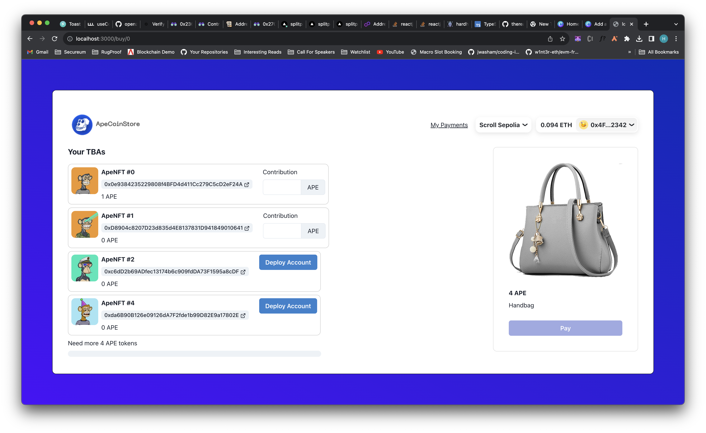

# SplitPay

### Team

-   Harpalsinh Jadeja
    -   twitter - harpaljadeja11
    -   email - jadejaharpal14@gmail.com

### Flow Diagram



### Problem

ERC-6551 Token Bound Accounts allow creating accounts for NFTs, but if we have a lot of NFTs we will have assets distributed in many accounts.

If the user wants to pay or buy something where in the amount to transfer is more than the balance of a single TBA then the user has to transfer assets among TBAs manually before he/she can proceed with the payment.

This project allows paying/buying without the user manually transferring assets among TBAs!

### Solution

Rather than making the users do transferring and figure out sending assets for payment/buy the project asks the users which accounts to use and how many assets from each account and does the transfer!



### Contract Address

#### Scroll Sepolia

-   ERC6551Registry - [0xF9dCbF5a1C021F56F04B2767f2707d36ECA10bbb](https://sepolia-blockscout.scroll.io/address/0xF9dCbF5a1C021F56F04B2767f2707d36ECA10bbb)

-   Simple6551Implementation - [0x5BD110776F5fF4aF16838C68C4DB711320852897](https://sepolia-blockscout.scroll.io/address/0x5BD110776F5fF4aF16838C68C4DB711320852897)

-   ApeNFT - [0xC323b2Dbddc165e028de78eb5Ca43a9072d037f5](https://sepolia-blockscout.scroll.io/address/0xC323b2Dbddc165e028de78eb5Ca43a9072d037f5)

-   ApeCoin - [0x070d4A2BCe5b31b4aC0687B5D11177d89090A5fF](https://sepolia-blockscout.scroll.io/address/0x070d4A2BCe5b31b4aC0687B5D11177d89090A5fF)

-   pNFT - [0xaC45c833E270300167b94DB759A21eAAE7eF5C78](https://sepolia-blockscout.scroll.io/address/0xaC45c833E270300167b94DB759A21eAAE7eF5C78)

-   Products - [0xec6cF839755522D60641E15C69caC507550d3151](https://sepolia-blockscout.scroll.io/address/0xec6cF839755522D60641E15C69caC507550d3151)

#### Mantle Testnet

-   ERC6551Registry - [0x5e42ba8188a68BB96a85b712F590f769fDBC1fE9](https://explorer.testnet.mantle.xyz/address/0x5e42ba8188a68BB96a85b712F590f769fDBC1fE9)

-   Simple6551Implementation - [0xB5e112494224096957AfA2d176f00F33c596Cf56](https://explorer.testnet.mantle.xyz/address/0xB5e112494224096957AfA2d176f00F33c596Cf56)

-   ApeNFT - [0x4C8AFaE32F6A3ea0B8bcF60FA23402D8E4099e99](https://explorer.testnet.mantle.xyz/address/0x4C8AFaE32F6A3ea0B8bcF60FA23402D8E4099e99)

-   ApeCoin - [0x070d4A2BCe5b31b4aC0687B5D11177d89090A5fF](https://explorer.testnet.mantle.xyz/address/0x070d4A2BCe5b31b4aC0687B5D11177d89090A5fF)

-   pNFT - [0xd45A1D84d62AA0976618a3B7c56D96ff0A2389c6](https://explorer.testnet.mantle.xyz/address/0xd45A1D84d62AA0976618a3B7c56D96ff0A2389c6)

-   Products - [0x6936D312C8b06d4b7EA879aEf32c2eE9E23B1305](https://explorer.testnet.mantle.xyz/address/0x6936D312C8b06d4b7EA879aEf32c2eE9E23B1305)

#### Mumbai Testnet

-   ERC6551Registry - [0x5BD110776F5fF4aF16838C68C4DB711320852897](https://mumbai.polygonscan.com/address/0x5BD110776F5fF4aF16838C68C4DB711320852897)

-   Simple6551Implementation - [0xF9dCbF5a1C021F56F04B2767f2707d36ECA10bbb](https://mumbai.polygonscan.com/address/0xF9dCbF5a1C021F56F04B2767f2707d36ECA10bbb)

-   ApeNFT - [0xd45A1D84d62AA0976618a3B7c56D96ff0A2389c6](https://mumbai.polygonscan.com/address/0xd45A1D84d62AA0976618a3B7c56D96ff0A2389c6)

-   ApeCoin - [0x070d4A2BCe5b31b4aC0687B5D11177d89090A5fF](https://mumbai.polygonscan.com/address/0x070d4A2BCe5b31b4aC0687B5D11177d89090A5fF)

-   pNFT - [0x2c8bf7Bd8bfbF6227DedD12cDe5f2AB3d60bA1B4](https://mumbai.polygonscan.com/address/0x2c8bf7Bd8bfbF6227DedD12cDe5f2AB3d60bA1B4)

-   Products - [0xFeE84A8b5ed258D61B457418f5F9C1c066906901](https://mumbai.polygonscan.com/address/0xFeE84A8b5ed258D61B457418f5F9C1c066906901)

### How to use?

#### Clone the repo

```bash
git clone https://github.com/therealharpaljadeja/splitpay-6551.git
```

#### Run the project

```bash
yarn dev
```

Contracts are already deployed, however you can manually run the scripts in the `/scripts` folder using the following command.

```bash
npx hardhat run <SCRIPT_PATH>
```

#### Future plans for the project

Make it more generalised for all TBAs currently only works for the contracts I have deployed.

#### Tech Stack

-   Solidity Smart Contracts
-   Deployed on Mantle Testnet, Scroll Sepolia and Mumbai Testnet
-   Wagmi, Viem and RainbowKit for Web3 Frontend Development
-   Hardhat for deployment
